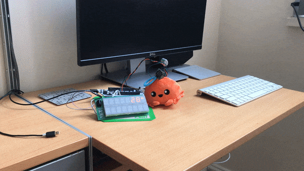
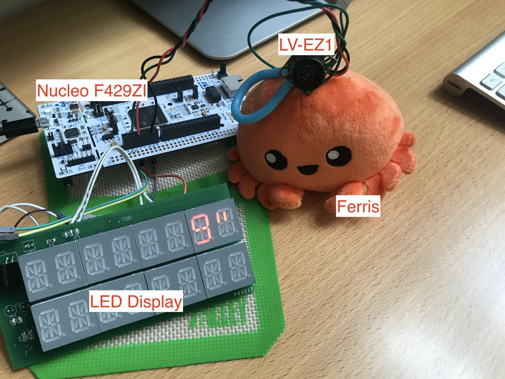

# Maxbotix Ultrasonic Sensor Demo

This system tells the distance between me and Ferris.

## Ingredients

### Hardware
- [Nucleo-F429ZI](https://www.st.com/en/evaluation-tools/nucleo-f429zi.html)
- [Maxbotix RangeFinder LV-EZ1](https://www.maxbotix.com/Ultrasonic_Sensors/MB1010.htm)
- LED display (custom made)
- [Ferris Plushie](https://devswag.com/products/rust-ferris)

### Crates
- [`stm32f4xx-hal`](https://crates.io/crates/stm32f4xx-hal)
- [`max6955`](https://crates.io/crates/max6955) A platform agnostic driver to interface with MAX6955 LED Display Driver

[See my blog post](https://lonesometraveler.github.io/2020/04/23/Maxbotix-Ultrasonic.html) about this project.
